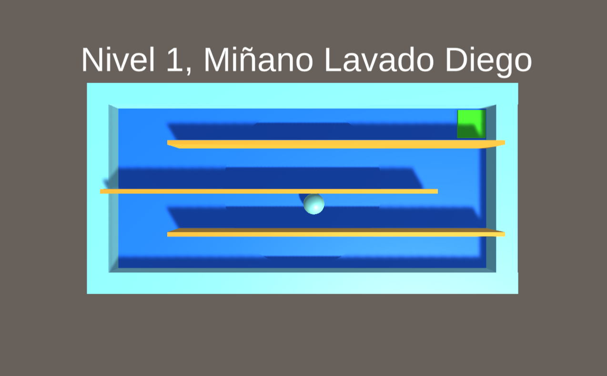
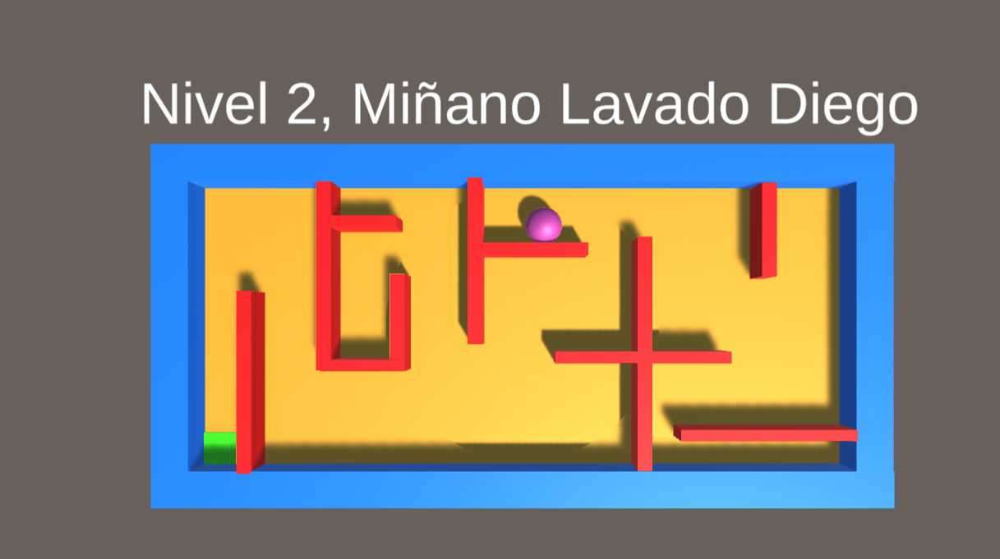
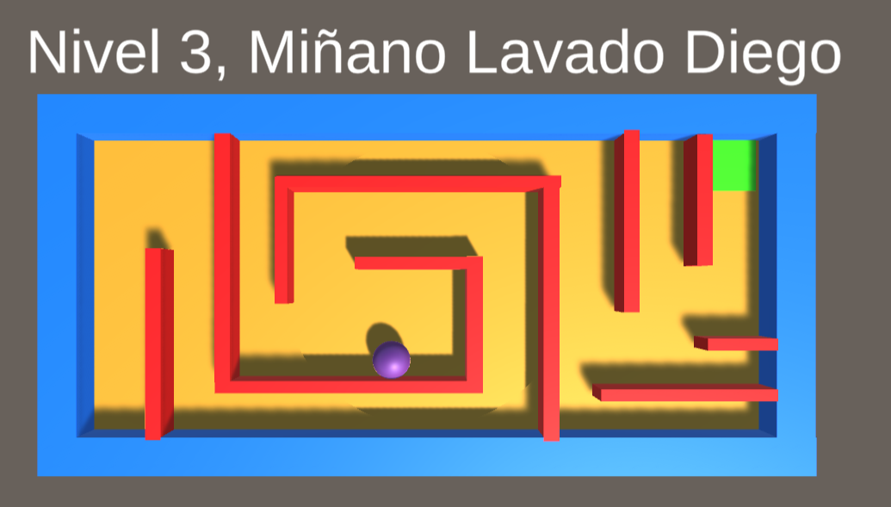
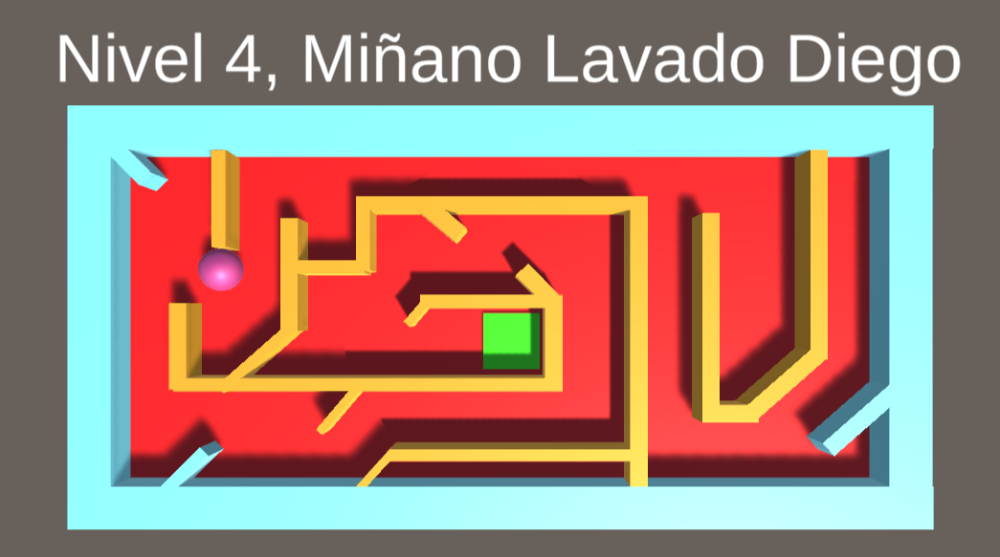

# 3D Maze Adventure

[](https://unity.com/)
[](https://learn.microsoft.com/en-us/dotnet/csharp/)
[](https://gatorrante.github.io/S8_Laberinto3D/)

Welcome to **3D Maze Adventure**, a simple yet engaging game where a ball navigates through increasingly complex mazes. This project is my second experience with Unity and C#, where I experimented with level design and gameplay mechanics.

## Table of Contents
- [Game Overview](#game-overview)
- [Features](#features)
- [Screenshots](#screenshots)
- [Installation](#installation)

## Game Overview
In **3D Maze Adventure**, you control a ball that changes color as it moves through each level. Your goal is to find the optimal path to reach the end of the maze. This project explores basic level design principles and introduces challenges across four unique levels.

## Features
- **4 Levels**: Each level presents a new maze with increasing difficulty.
- **Dynamic Ball Color**: The ball changes color as you progress through the maze.
- **Simple Controls**: Easy to learn, hard to master gameplay mechanics.

## Screenshots
Here are some snapshots of the game:

**Level 1:**


**Level 2:**


**Level 3:**


**Level 4:**


## Installation
To clone and run this project locally, you'll need Git installed on your computer. From your command line:

```bash
# Clone the repository
git clone https://github.com/Gatorrante/S8_Laberinto3D.git

# Navigate into the project directory
cd S8_Laberinto3D

# Open the project in Unity
